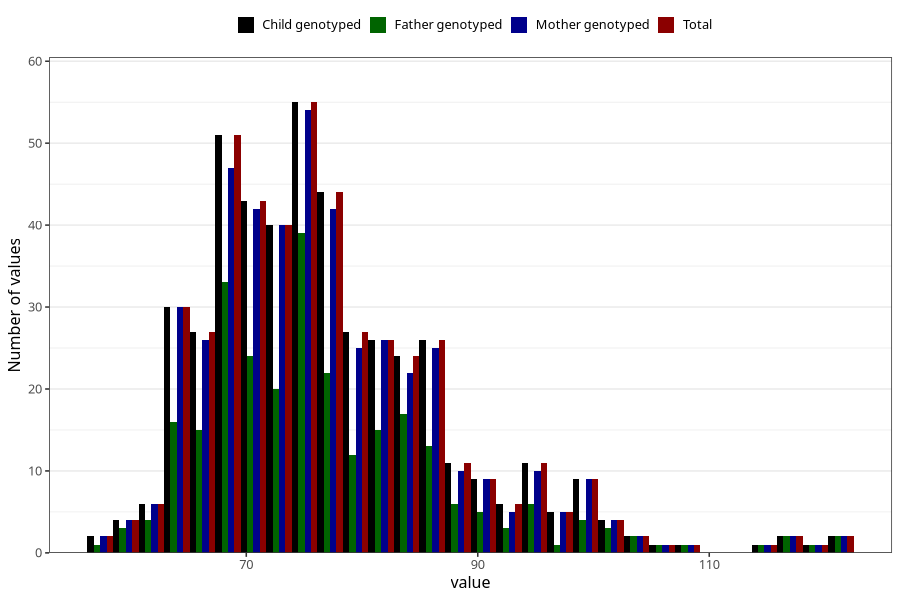

# waist_cm_wf
Variable mapping to `WK13` in `WF_Klinikkskjema_v12`.
- Number of values:

| Value | Total | Child genotyped | Mother genotyped | Father genotyped |
| ----- | ----- | --------------- | ---------------- | ---------------- |
| Missing | 80553 | 80553 | 75776 | 53039 |
| Non-missing | 470 | 470 | 453 | 272 |
| 25th percentile | 69 | 69 | 69 | 69 |
| 50th percentile | 75 | 75 | 75 | 75 |
| 75th percentile | 82 | 82 | 82 | 82.25 |
| Mean | 77.0702127659575 | 77.0702127659575 | 77.0286975717439 | 77.2683823529412 |
| Standard deviation | 10.5596773972986 | 10.5596773972986 | 10.6189664734212 | 11.3640541737032 |
| N | 470 | 470 | 453 | 272 |

