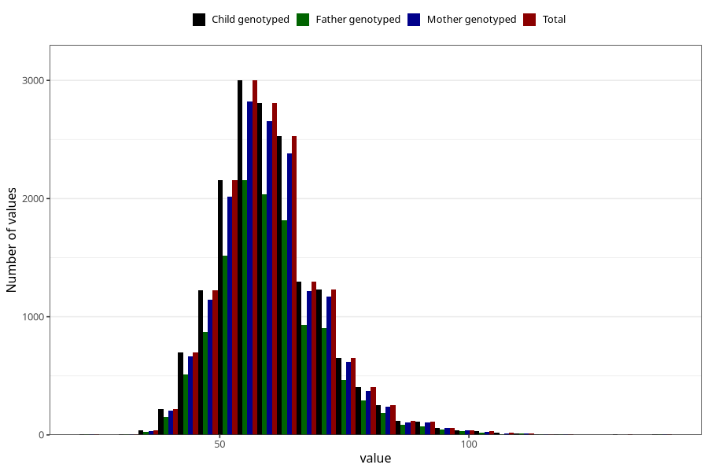

# weight_14c
Variable mapping to `UB221` in `Ungdomsskjema_Barn_v12_standard`.
- Number of values:

| Value | Total | Child genotyped | Mother genotyped | Father genotyped |
| ----- | ----- | --------------- | ---------------- | ---------------- |
| Missing | 64077 | 64077 | 60291 | 41145 |
| Non-missing | 16946 | 16946 | 15938 | 12166 |
| 25th percentile | 53 | 53 | 53 | 53 |
| 50th percentile | 59 | 59 | 59 | 59 |
| 75th percentile | 66 | 66 | 66 | 66 |
| Mean | 60.3577835477399 | 60.3577835477399 | 60.3534320491906 | 60.3407036001973 |
| Standard deviation | 10.9822081988277 | 10.9822081988277 | 10.9480170554593 | 10.8981338069828 |
| N | 16946 | 16946 | 15938 | 12166 |

