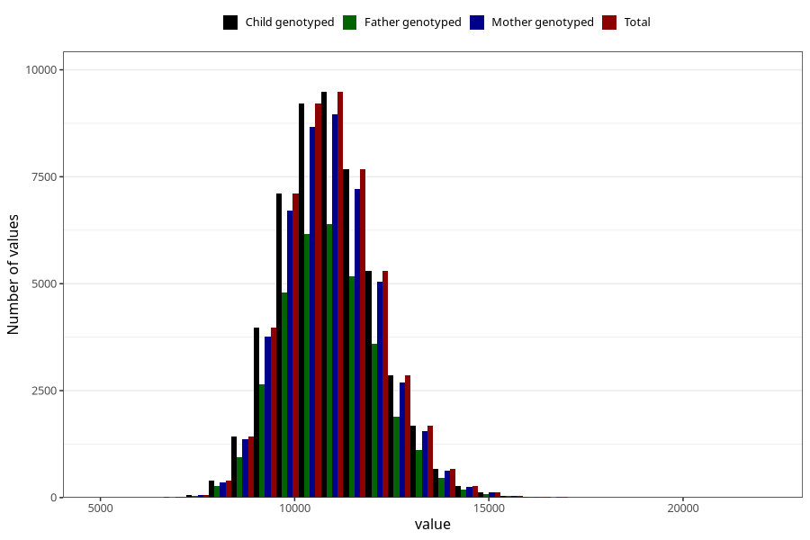

# weight_15_18m_1
Variable mapping to `EE398` in `Skjema5_18mnd_v12`.
- Number of values:

| Value | Total | Child genotyped | Mother genotyped | Father genotyped |
| ----- | ----- | --------------- | ---------------- | ---------------- |
| Missing | 30701 | 30701 | 28784 | 19533 |
| Non-missing | 50322 | 50322 | 47445 | 33778 |
| 25th percentile | 10060 | 10060 | 10060 | 10065.25 |
| 50th percentile | 10860 | 10860 | 10860 | 10862.5 |
| 75th percentile | 11700 | 11700 | 11700 | 11700 |
| Mean | 10925.1663685863 | 10925.1663685863 | 10924.0454420908 | 10925.7637219492 |
| Standard deviation | 1219.64350935917 | 1219.64350935917 | 1219.85018321119 | 1214.88750604541 |
| N | 50322 | 50322 | 47445 | 33778 |

