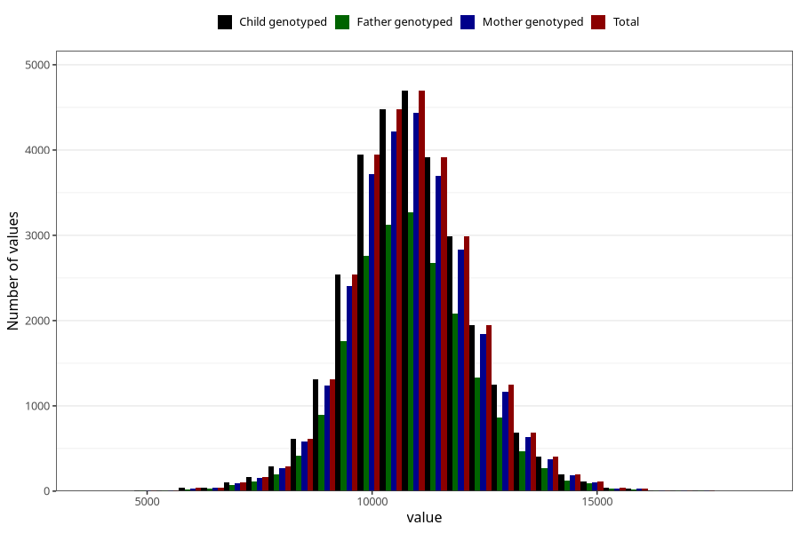

# weight_15_18m_2
Variable mapping to `GG16` in `Skjema6_3aar_v12`.
- Number of values:

| Value | Total | Child genotyped | Mother genotyped | Father genotyped |
| ----- | ----- | --------------- | ---------------- | ---------------- |
| Missing | 51203 | 51203 | 48108 | 32658 |
| Non-missing | 29820 | 29820 | 28121 | 20653 |
| 25th percentile | 10000 | 10000 | 10000 | 10000 |
| 50th percentile | 10800 | 10800 | 10800 | 10800 |
| 75th percentile | 11700 | 11700 | 11700 | 11700 |
| Mean | 10861.3689470154 | 10861.3689470154 | 10859.5605419437 | 10861.6608725125 |
| Standard deviation | 1362.82420196238 | 1362.82420196238 | 1358.99323879332 | 1360.16025795027 |
| N | 29820 | 29820 | 28121 | 20653 |

