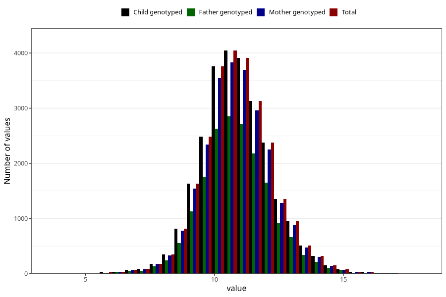

# weight_16m
Variable created during phenotype curation.
- Number of values:

| Value | Total | Child genotyped | Mother genotyped | Father genotyped |
| ----- | ----- | --------------- | ---------------- | ---------------- |
| Missing | 54656 | 54656 | 51347 | 34976 |
| Non-missing | 26367 | 26367 | 24882 | 18335 |
| 25th percentile | 10 | 10 | 10 | 10 |
| 50th percentile | 10.81 | 10.81 | 10.81 | 10.8 |
| 75th percentile | 11.7 | 11.7 | 11.7 | 11.7 |
| Mean | 10.8704413092123 | 10.8704413092123 | 10.8690071537658 | 10.8695610035451 |
| Standard deviation | 1.34818485762757 | 1.34818485762757 | 1.34490396076007 | 1.34498364045858 |
| N | 26367 | 26367 | 24882 | 18335 |

