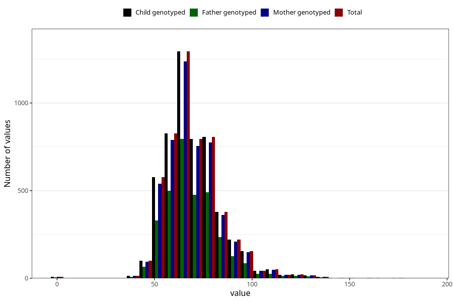

# weight_18
Variable mapping to `VE44` in `18-aarsskjema_v12_standard`.
- Number of values:

| Value | Total | Child genotyped | Mother genotyped | Father genotyped |
| ----- | ----- | --------------- | ---------------- | ---------------- |
| Missing | 75672 | 75672 | 71136 | 50093 |
| Non-missing | 5351 | 5351 | 5093 | 3218 |
| 25th percentile | 60 | 60 | 60 | 60 |
| 50th percentile | 68 | 68 | 68 | 68 |
| 75th percentile | 77 | 77 | 77 | 77 |
| Mean | 70.0932535974584 | 70.0932535974584 | 70.0820734341253 | 69.9925419515227 |
| Standard deviation | 15.0509320135846 | 15.0509320135846 | 14.9065806133464 | 14.7811705595535 |
| N | 5351 | 5351 | 5093 | 3218 |

