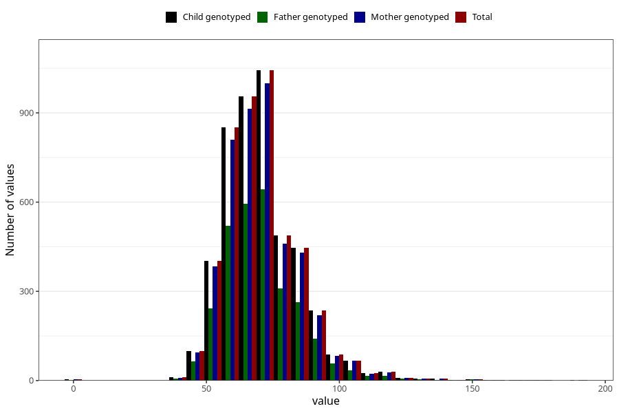

# weight_19
Variable mapping to `VG135` in `19_aarsskjema_standard`.
- Number of values:

| Value | Total | Child genotyped | Mother genotyped | Father genotyped |
| ----- | ----- | --------------- | ---------------- | ---------------- |
| Missing | 76237 | 76237 | 71664 | 50375 |
| Non-missing | 4786 | 4786 | 4565 | 2936 |
| 25th percentile | 61 | 61 | 61 | 61 |
| 50th percentile | 69 | 69 | 69 | 69 |
| 75th percentile | 79 | 79 | 79 | 78 |
| Mean | 71.0129544504806 | 71.0129544504806 | 70.9964950711939 | 70.9029291553133 |
| Standard deviation | 14.8242169406926 | 14.8242169406926 | 14.8159756369813 | 14.6066813352099 |
| N | 4786 | 4786 | 4565 | 2936 |

