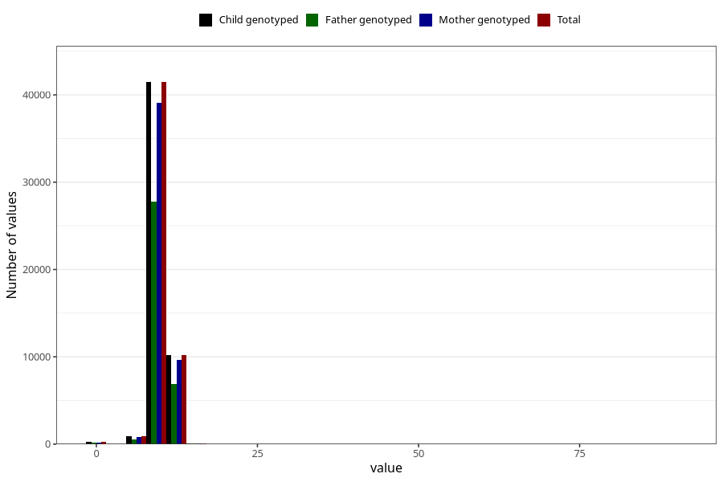

# weight_1y
Variable mapping to `EE392` in `Skjema5_18mnd_v12`.
- Number of values:

| Value | Total | Child genotyped | Mother genotyped | Father genotyped |
| ----- | ----- | --------------- | ---------------- | ---------------- |
| Missing | 28149 | 28149 | 26380 | 17897 |
| Non-missing | 52874 | 52874 | 49849 | 35414 |
| 25th percentile | 9.15 | 9.15 | 9.15 | 9.16 |
| 50th percentile | 9.88 | 9.88 | 9.88 | 9.885 |
| 75th percentile | 10.645 | 10.645 | 10.645 | 10.64 |
| Mean | 9.90523079396301 | 9.90523079396301 | 9.90531862223916 | 9.90859391765968 |
| Standard deviation | 1.30718824675369 | 1.30718824675369 | 1.30745774615884 | 1.32121168968136 |
| N | 52874 | 52874 | 49849 | 35414 |

