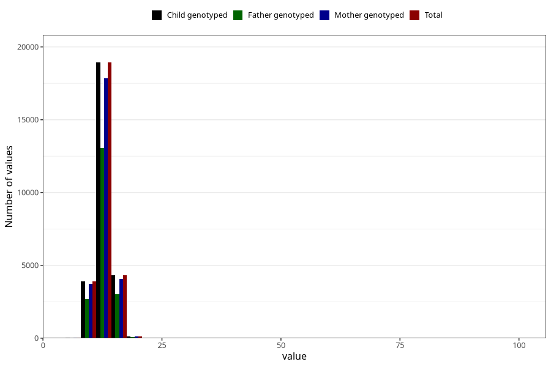

# weight_2y
Variable mapping to `GG21` in `Skjema6_3aar_v12`.
- Number of values:

| Value | Total | Child genotyped | Mother genotyped | Father genotyped |
| ----- | ----- | --------------- | ---------------- | ---------------- |
| Missing | 53685 | 53685 | 50459 | 34454 |
| Non-missing | 27338 | 27338 | 25770 | 18857 |
| 25th percentile | 11.9 | 11.9 | 11.9 | 11.9 |
| 50th percentile | 12.9 | 12.9 | 12.9 | 12.9 |
| 75th percentile | 14 | 14 | 14 | 14 |
| Mean | 12.9157100007316 | 12.9157100007316 | 12.9147892898719 | 12.9297730285836 |
| Standard deviation | 1.99217143506766 | 1.99217143506766 | 2.01501428877103 | 2.0107816600558 |
| N | 27338 | 27338 | 25770 | 18857 |

