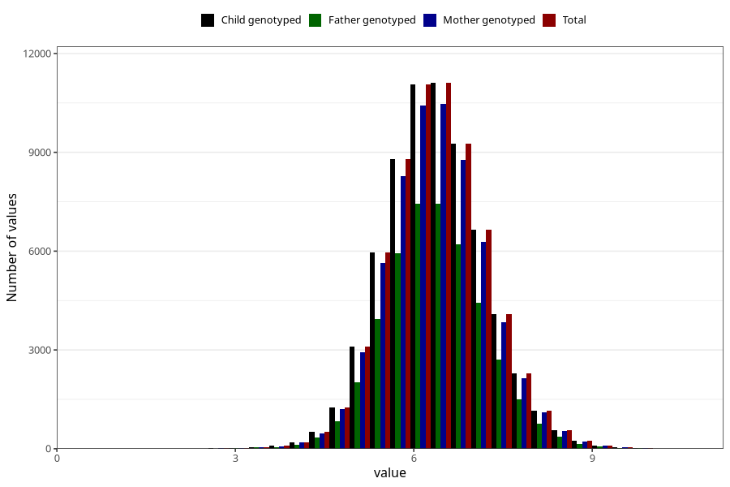

# weight_3m
Variable mapping to `DD218` in `Skjema4_6mnd_v12`.
- Number of values:

| Value | Total | Child genotyped | Mother genotyped | Father genotyped |
| ----- | ----- | --------------- | ---------------- | ---------------- |
| Missing | 14445 | 14445 | 13458 | 8876 |
| Non-missing | 66578 | 66578 | 62771 | 44435 |
| 25th percentile | 5.82 | 5.82 | 5.82 | 5.83 |
| 50th percentile | 6.35 | 6.35 | 6.35 | 6.35 |
| 75th percentile | 6.9 | 6.9 | 6.9 | 6.9 |
| Mean | 6.37674414971913 | 6.37674414971913 | 6.37565641777254 | 6.37578372904242 |
| Standard deviation | 0.830914943497811 | 0.830914943497811 | 0.82991957956088 | 0.824920310265549 |
| N | 66578 | 66578 | 62771 | 44435 |

