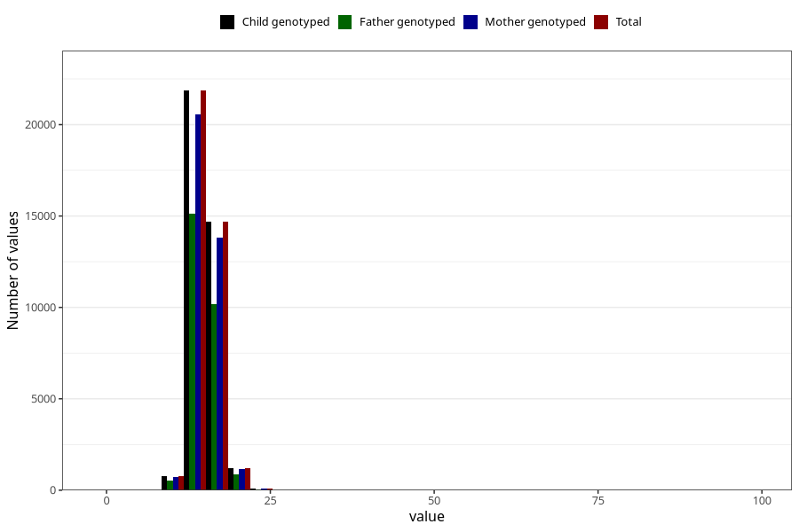

# weight_3y
Variable mapping to `GG26` in `Skjema6_3aar_v12`.
- Number of values:

| Value | Total | Child genotyped | Mother genotyped | Father genotyped |
| ----- | ----- | --------------- | ---------------- | ---------------- |
| Missing | 42378 | 42378 | 39903 | 26556 |
| Non-missing | 38645 | 38645 | 36326 | 26755 |
| 25th percentile | 14 | 14 | 14 | 14 |
| 50th percentile | 15 | 15 | 15 | 15 |
| 75th percentile | 16 | 16 | 16 | 16 |
| Mean | 15.0619133134946 | 15.0619133134946 | 15.0606282001872 | 15.0689067464025 |
| Standard deviation | 1.89495466464994 | 1.89495466464994 | 1.897997082916 | 1.854609129006 |
| N | 38645 | 38645 | 36326 | 26755 |

