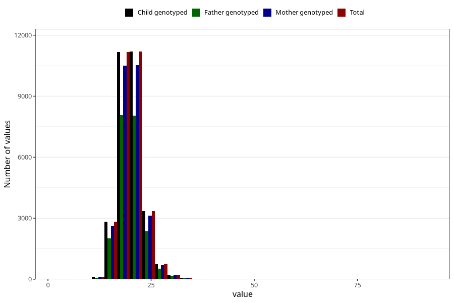

# weight_5y
Variable mapping to `LL13` in `Skjema5aar_v12`.
- Number of values:

| Value | Total | Child genotyped | Mother genotyped | Father genotyped |
| ----- | ----- | --------------- | ---------------- | ---------------- |
| Missing | 51339 | 51339 | 48329 | 32045 |
| Non-missing | 29684 | 29684 | 27900 | 21266 |
| 25th percentile | 18 | 18 | 18 | 18 |
| 50th percentile | 20 | 20 | 20 | 20 |
| 75th percentile | 21.5 | 21.5 | 21.5 | 21.5 |
| Mean | 20.0194448187576 | 20.0194448187576 | 20.0237025089606 | 20.0004326154425 |
| Standard deviation | 3.0795065719526 | 3.0795065719526 | 3.09179440493998 | 3.04724068728604 |
| N | 29684 | 29684 | 27900 | 21266 |

