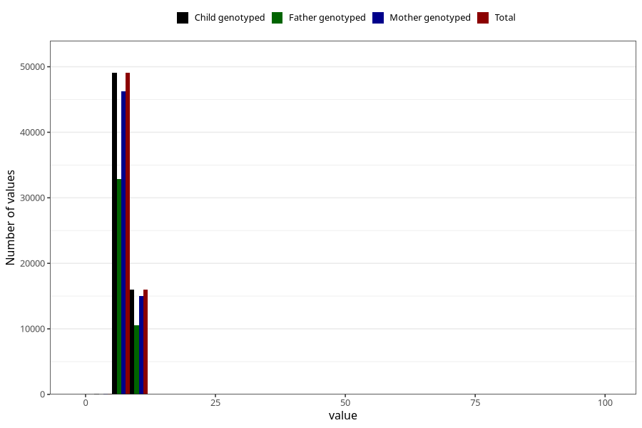

# weight_6m
Variable mapping to `DD224` in `Skjema4_6mnd_v12`.
- Number of values:

| Value | Total | Child genotyped | Mother genotyped | Father genotyped |
| ----- | ----- | --------------- | ---------------- | ---------------- |
| Missing | 15913 | 15913 | 14845 | 9848 |
| Non-missing | 65110 | 65110 | 61384 | 43463 |
| 25th percentile | 7.27 | 7.27 | 7.27 | 7.26 |
| 50th percentile | 7.885 | 7.885 | 7.88 | 7.88 |
| 75th percentile | 8.53 | 8.53 | 8.53 | 8.525 |
| Mean | 7.93787467362924 | 7.93787467362924 | 7.93729624983709 | 7.93387437590594 |
| Standard deviation | 1.17289646653144 | 1.17289646653144 | 1.18402649540841 | 1.14685018186996 |
| N | 65110 | 65110 | 61384 | 43463 |

