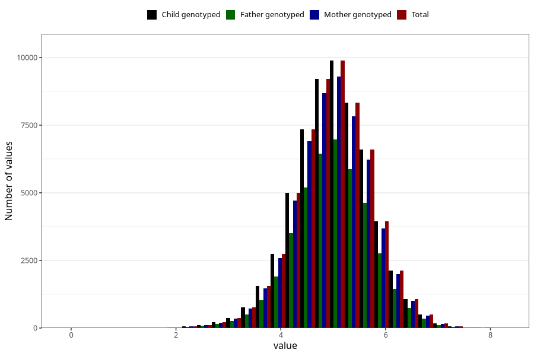

# weight_6w
Variable mapping to `DD212` in `Skjema4_6mnd_v12`.
- Number of values:

| Value | Total | Child genotyped | Mother genotyped | Father genotyped |
| ----- | ----- | --------------- | ---------------- | ---------------- |
| Missing | 20880 | 20880 | 19684 | 11232 |
| Non-missing | 60143 | 60143 | 56545 | 42079 |
| 25th percentile | 4.545 | 4.545 | 4.545 | 4.55 |
| 50th percentile | 5.01 | 5.01 | 5.005 | 5.01 |
| 75th percentile | 5.474 | 5.474 | 5.47 | 5.47 |
| Mean | 4.99936735779725 | 4.99936735779725 | 4.99840769298789 | 5.00060172532617 |
| Standard deviation | 0.728855386329176 | 0.728855386329176 | 0.728063540740632 | 0.723367541425842 |
| N | 60143 | 60143 | 56545 | 42079 |

