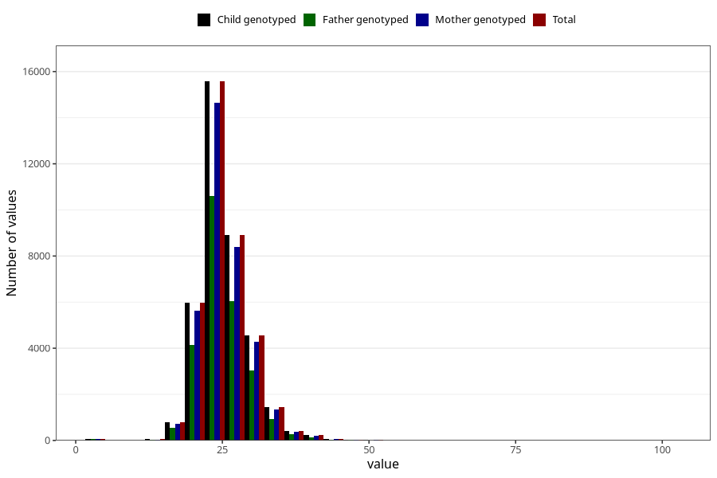

# weight_7y
Variable mapping to `JJ325` in `Skjema7aar_v12`.
- Number of values:

| Value | Total | Child genotyped | Mother genotyped | Father genotyped |
| ----- | ----- | --------------- | ---------------- | ---------------- |
| Missing | 42917 | 42917 | 40340 | 27455 |
| Non-missing | 38106 | 38106 | 35889 | 25856 |
| 25th percentile | 22.4 | 22.4 | 22.4 | 22.3 |
| 50th percentile | 25 | 25 | 25 | 24.9 |
| 75th percentile | 27.5 | 27.5 | 27.5 | 27.3 |
| Mean | 25.1990211515247 | 25.1990211515247 | 25.1968681211513 | 25.1345335705446 |
| Standard deviation | 4.3075967093669 | 4.3075967093669 | 4.29356714063618 | 4.22736613543733 |
| N | 38106 | 38106 | 35889 | 25856 |

