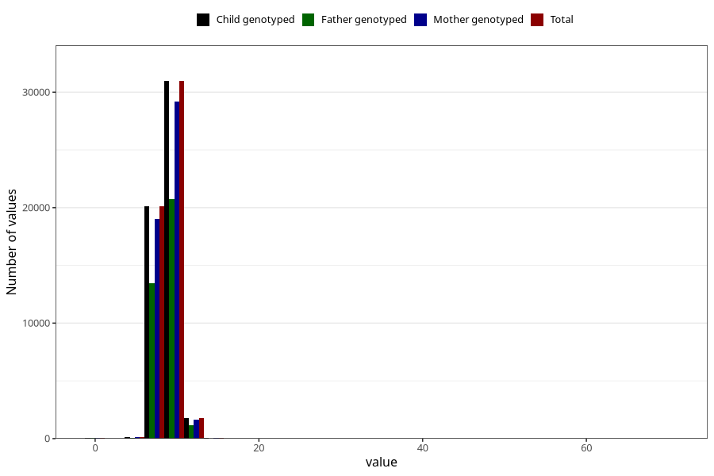

# weight_8m
Variable mapping to `EE386` in `Skjema5_18mnd_v12`.
- Number of values:

| Value | Total | Child genotyped | Mother genotyped | Father genotyped |
| ----- | ----- | --------------- | ---------------- | ---------------- |
| Missing | 27947 | 27947 | 26177 | 17765 |
| Non-missing | 53076 | 53076 | 50052 | 35546 |
| 25th percentile | 8.075 | 8.075 | 8.07325 | 8.08 |
| 50th percentile | 8.75 | 8.75 | 8.745 | 8.75 |
| 75th percentile | 9.46 | 9.46 | 9.46 | 9.46 |
| Mean | 8.79155769085839 | 8.79155769085839 | 8.79091416926397 | 8.7946969841895 |
| Standard deviation | 1.13306859938651 | 1.13306859938651 | 1.13442545983375 | 1.14463476339535 |
| N | 53076 | 53076 | 50052 | 35546 |

