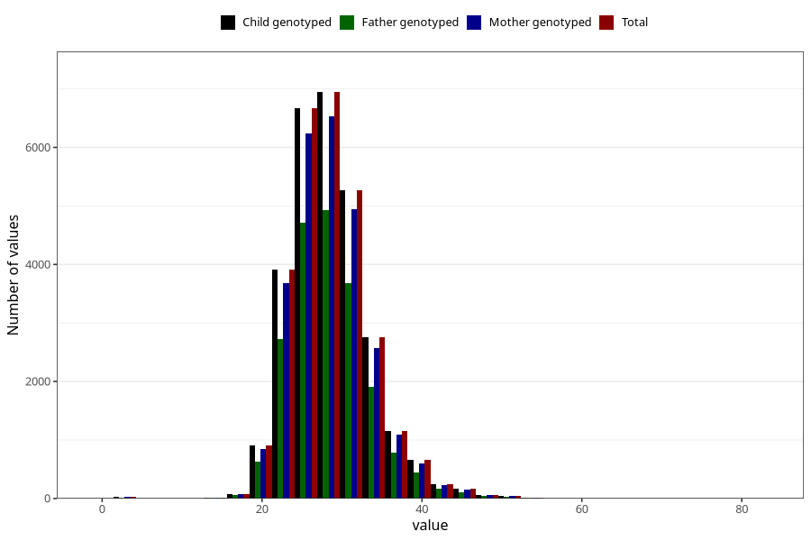

# weight_8y
Variable mapping to `NN25` in `Skjema8aar_v12`.
- Number of values:

| Value | Total | Child genotyped | Mother genotyped | Father genotyped |
| ----- | ----- | --------------- | ---------------- | ---------------- |
| Missing | 52126 | 52126 | 49102 | 33061 |
| Non-missing | 28897 | 28897 | 27127 | 20250 |
| 25th percentile | 25 | 25 | 25 | 25 |
| 50th percentile | 28 | 28 | 28 | 28 |
| 75th percentile | 31 | 31 | 31 | 31 |
| Mean | 28.4891753469218 | 28.4891753469218 | 28.4906255759944 | 28.455550617284 |
| Standard deviation | 4.97351106998382 | 4.97351106998382 | 4.98208064527232 | 4.94511813290077 |
| N | 28897 | 28897 | 27127 | 20250 |

