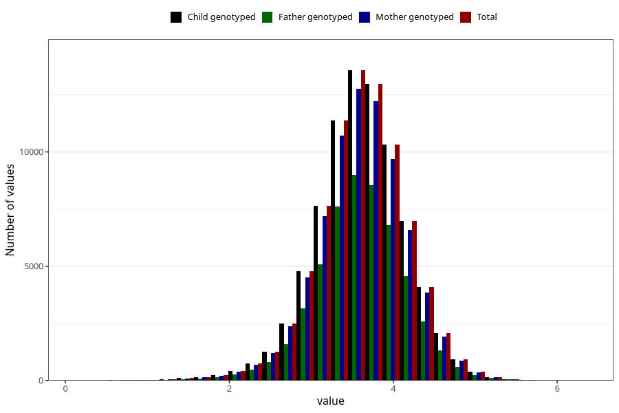

# weight_birth
Variable mapping to `VEKT` in `MFR_541_v12`.
Variable mapping to `VEKT` in `MFR_541_v12`.
- Number of values:

| Value | Total | Child genotyped | Mother genotyped | Father genotyped |
| ----- | ----- | --------------- | ---------------- | ---------------- |
| Missing | 99 | 99 | 94 | 64 |
| Non-missing | 80924 | 80924 | 76135 | 53247 |
| 25th percentile | 3.28 | 3.28 | 3.28 | 3.28 |
| 50th percentile | 3.62 | 3.62 | 3.62 | 3.615 |
| 75th percentile | 3.955 | 3.955 | 3.952 | 3.95 |
| Mean | 3.60624303049775 | 3.60624303049775 | 3.6060910487949 | 3.60467945611959 |
| Standard deviation | 0.546692604683075 | 0.546692604683075 | 0.546408237155574 | 0.543135063771063 |
| N | 80924 | 80924 | 76135 | 53247 |

