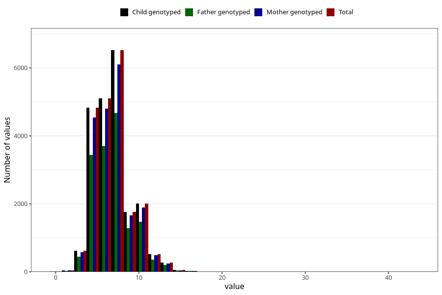

# age_first_tooth
Variable mapping to `EE1012` in `Skjema5_18mnd_v12`.
- Number of values:

| Value | Total | Child genotyped | Mother genotyped | Father genotyped |
| ----- | ----- | --------------- | ---------------- | ---------------- |
| Missing | 59253 | 59253 | 55781 | 37619 |
| Non-missing | 21770 | 21770 | 20448 | 15692 |
| 25th percentile | 5 | 5 | 5 | 5 |
| 50th percentile | 7 | 7 | 7 | 7 |
| 75th percentile | 8 | 8 | 8 | 8 |
| Mean | 6.95305466237942 | 6.95305466237942 | 6.94576486697966 | 6.95462656130512 |
| Standard deviation | 2.25817680480025 | 2.25817680480025 | 2.23995618024451 | 2.24478228043664 |
| N | 21770 | 21770 | 20448 | 15692 |

