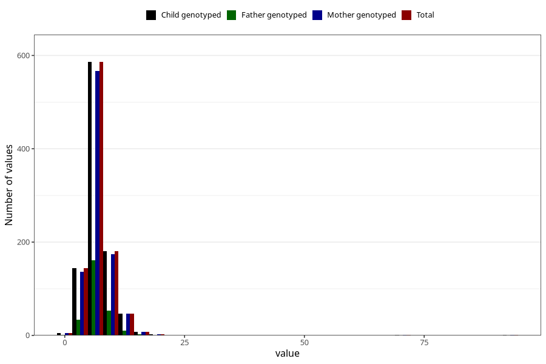

# age_lost_first_tooth_months
Variable mapping to `JJ330` in `Skjema7aar_v12`.
- Number of values:

| Value | Total | Child genotyped | Mother genotyped | Father genotyped |
| ----- | ----- | --------------- | ---------------- | ---------------- |
| Missing | 80050 | 80050 | 75288 | 53051 |
| Non-missing | 973 | 973 | 941 | 260 |
| 25th percentile | 5 | 5 | 5 | 5.75 |
| 50th percentile | 6 | 6 | 6 | 7 |
| 75th percentile | 8 | 8 | 8 | 8.25 |
| Mean | 7.14594039054471 | 7.14594039054471 | 7.1721572794899 | 7.09230769230769 |
| Standard deviation | 4.28381926250505 | 4.28381926250505 | 4.3410595971837 | 2.4207792671312 |
| N | 973 | 973 | 941 | 260 |

