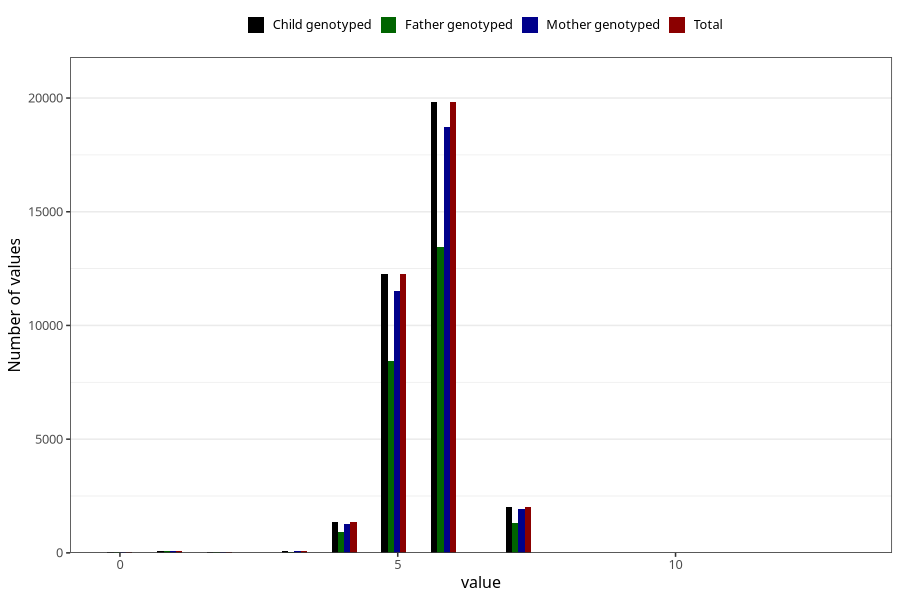

# age_lost_first_tooth_years
Variable mapping to `JJ332` in `Skjema7aar_v12`.
- Number of values:

| Value | Total | Child genotyped | Mother genotyped | Father genotyped |
| ----- | ----- | --------------- | ---------------- | ---------------- |
| Missing | 45284 | 45284 | 42545 | 29032 |
| Non-missing | 35739 | 35739 | 33684 | 24279 |
| 0 | 52 | 52 | 50 | 34 |
| 1 | 96 | 96 | 90 | 61 |
| 2 | 30 | 30 | 28 | 21 |
| 3 | 89 | 89 | 80 | 55 |
| 4 | 1365 | 1365 | 1270 | 918 |
| 5 | 12251 | 12251 | 11535 | 8418 |
| 6 | 19817 | 19817 | 18706 | 13449 |
| 7 | 2037 | 2037 | 1923 | 1323 |
| 8 | 1 | 1 | 1 | 0 |
| 13 | 1 | 1 | 1 | 0 |

