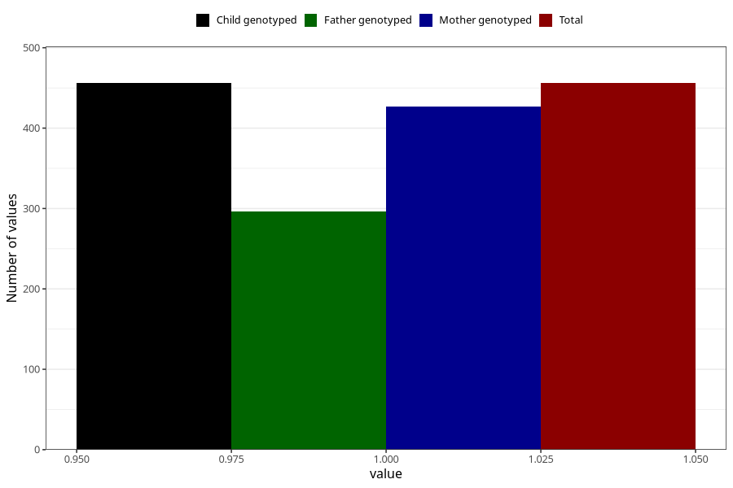

# allergy_affecing_eyes_nose_previous_3y
Variable mapping to `GG75` in `Skjema6_3aar_v12`.
- Number of values:

| Value | Total | Child genotyped | Mother genotyped | Father genotyped |
| ----- | ----- | --------------- | ---------------- | ---------------- |
| Missing | 80567 | 80567 | 75802 | 53015 |
| Non-missing | 456 | 456 | 427 | 296 |
| 1 | 456 | 456 | 427 | 296 |

