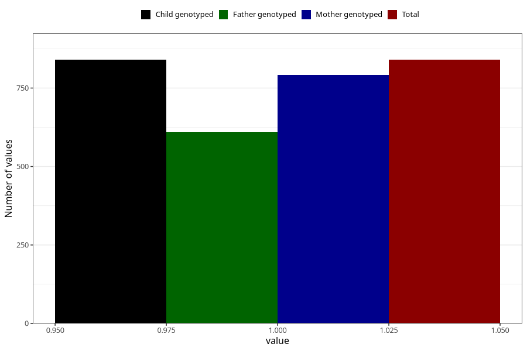

# asthma_previously_18m
Variable mapping to `EE825` in `Skjema5_18mnd_v12`.
- Number of values:

| Value | Total | Child genotyped | Mother genotyped | Father genotyped |
| ----- | ----- | --------------- | ---------------- | ---------------- |
| Missing | 80183 | 80183 | 75437 | 52702 |
| Non-missing | 840 | 840 | 792 | 609 |
| 1 | 840 | 840 | 792 | 609 |

