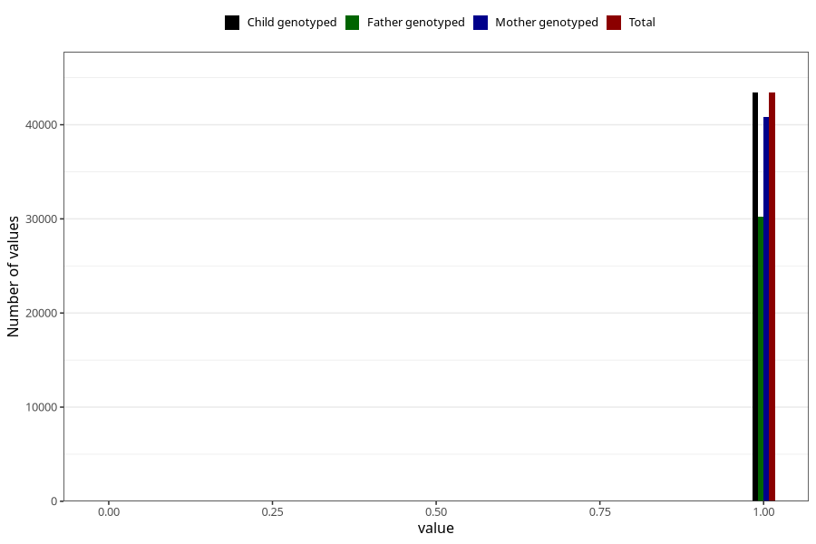

# autistic_traits_2_no_3y
Variable mapping to `GG582` in `Skjema6_3aar_v12`.
- Number of values:

| Value | Total | Child genotyped | Mother genotyped | Father genotyped |
| ----- | ----- | --------------- | ---------------- | ---------------- |
| Missing | 37596 | 37596 | 35393 | 23032 |
| Non-missing | 43427 | 43427 | 40836 | 30279 |
| 0 | 21 | 21 | 19 | 12 |
| 1 | 43406 | 43406 | 40817 | 30267 |

