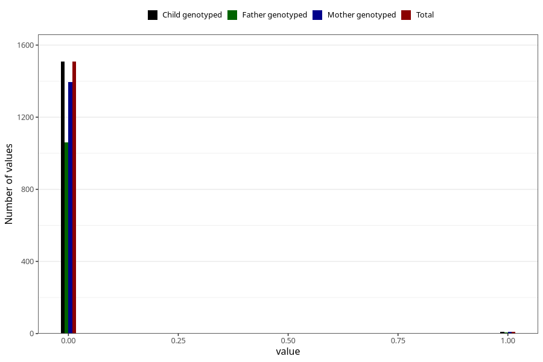

# autistic_traits_2_previous_3y
Variable mapping to `GG584` in `Skjema6_3aar_v12`.
- Number of values:

| Value | Total | Child genotyped | Mother genotyped | Father genotyped |
| ----- | ----- | --------------- | ---------------- | ---------------- |
| Missing | 79505 | 79505 | 74825 | 52246 |
| Non-missing | 1518 | 1518 | 1404 | 1065 |
| 0 | 1508 | 1508 | 1396 | 1059 |
| 1 | 10 | 10 | 8 | 6 |

