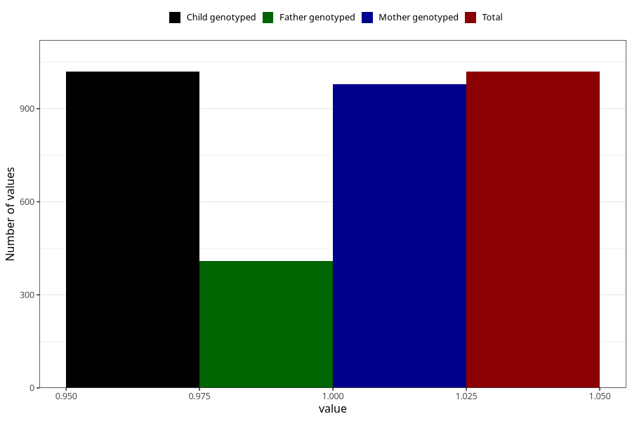

# autistic_traits_no_3y
Variable mapping to `GG101` in `Skjema6_3aar_v12`.
- Number of values:

| Value | Total | Child genotyped | Mother genotyped | Father genotyped |
| ----- | ----- | --------------- | ---------------- | ---------------- |
| Missing | 80004 | 80004 | 75250 | 52901 |
| Non-missing | 1019 | 1019 | 979 | 410 |
| 1 | 1019 | 1019 | 979 | 410 |

