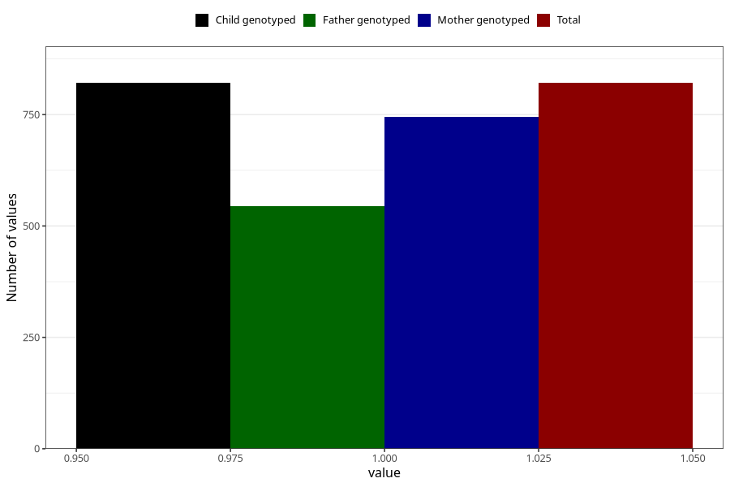

# behavioral_problems_difficult_and_unruly_past_8y
Variable mapping to `NN58` in `Skjema8aar_v12`.
- Number of values:

| Value | Total | Child genotyped | Mother genotyped | Father genotyped |
| ----- | ----- | --------------- | ---------------- | ---------------- |
| Missing | 80202 | 80202 | 75484 | 52766 |
| Non-missing | 821 | 821 | 745 | 545 |
| 1 | 821 | 821 | 745 | 545 |

