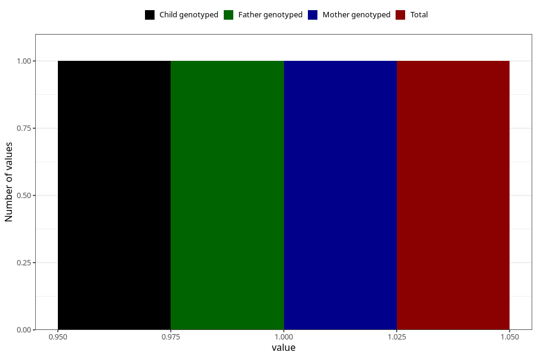

# chronic_fatigue_syndrome_me_7y
Variable mapping to `JJ438` in `Skjema7aar_v12`.
- Number of values:

| Value | Total | Child genotyped | Mother genotyped | Father genotyped |
| ----- | ----- | --------------- | ---------------- | ---------------- |
| Missing | 81022 | 81022 | 76228 | 53310 |
| Non-missing | 1 | 1 | 1 | 1 |
| 1 | 1 | 1 | 1 | 1 |

