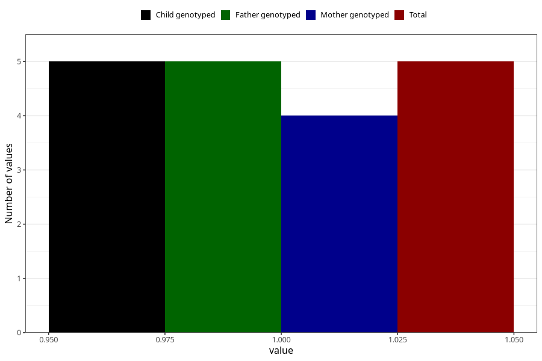

# chronic_fatigue_syndrome_me_8y
Variable mapping to `NN28` in `Skjema8aar_v12`.
- Number of values:

| Value | Total | Child genotyped | Mother genotyped | Father genotyped |
| ----- | ----- | --------------- | ---------------- | ---------------- |
| Missing | 81018 | 81018 | 76225 | 53306 |
| Non-missing | 5 | 5 | 4 | 5 |
| 1 | 5 | 5 | 4 | 5 |

