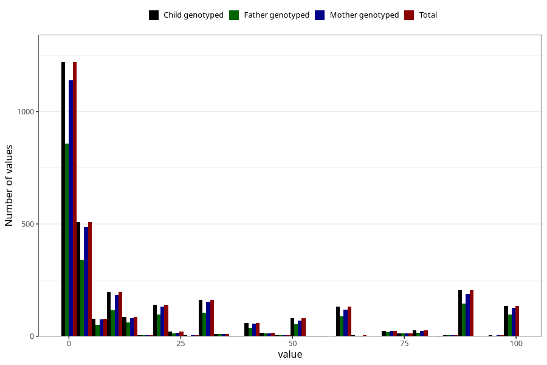

# colic_freq_6m
Variable mapping to `DD304` in `Skjema4_6mnd_v12`.
- Number of values:

| Value | Total | Child genotyped | Mother genotyped | Father genotyped |
| ----- | ----- | --------------- | ---------------- | ---------------- |
| Missing | 77872 | 77872 | 73281 | 51149 |
| Non-missing | 3151 | 3151 | 2948 | 2162 |
| 25th percentile | 1 | 1 | 1 | 1 |
| 50th percentile | 4 | 4 | 4 | 4 |
| 75th percentile | 30 | 30 | 30 | 30 |
| Mean | 21.8289431926373 | 21.8289431926373 | 21.6316146540027 | 22.067992599445 |
| Standard deviation | 31.1715213961822 | 31.1715213961822 | 31.1046153030448 | 31.5195230854386 |
| N | 3151 | 3151 | 2948 | 2162 |

