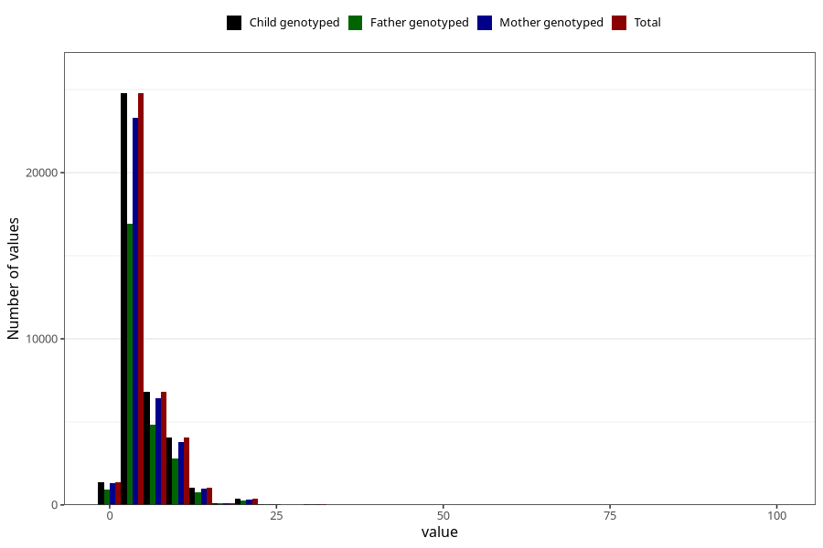

# common_cold_freq_3y
Variable mapping to `GG129` in `Skjema6_3aar_v12`.
- Number of values:

| Value | Total | Child genotyped | Mother genotyped | Father genotyped |
| ----- | ----- | --------------- | ---------------- | ---------------- |
| Missing | 42365 | 42365 | 39872 | 26639 |
| Non-missing | 38658 | 38658 | 36357 | 26672 |
| 25th percentile | 3 | 3 | 3 | 3 |
| 50th percentile | 4 | 4 | 4 | 4 |
| 75th percentile | 6 | 6 | 6 | 6 |
| Mean | 5.27466501112318 | 5.27466501112318 | 5.2683939819017 | 5.31591181763647 |
| Standard deviation | 4.1818965135767 | 4.1818965135767 | 4.16503070671658 | 4.11669477218643 |
| N | 38658 | 38658 | 36357 | 26672 |

