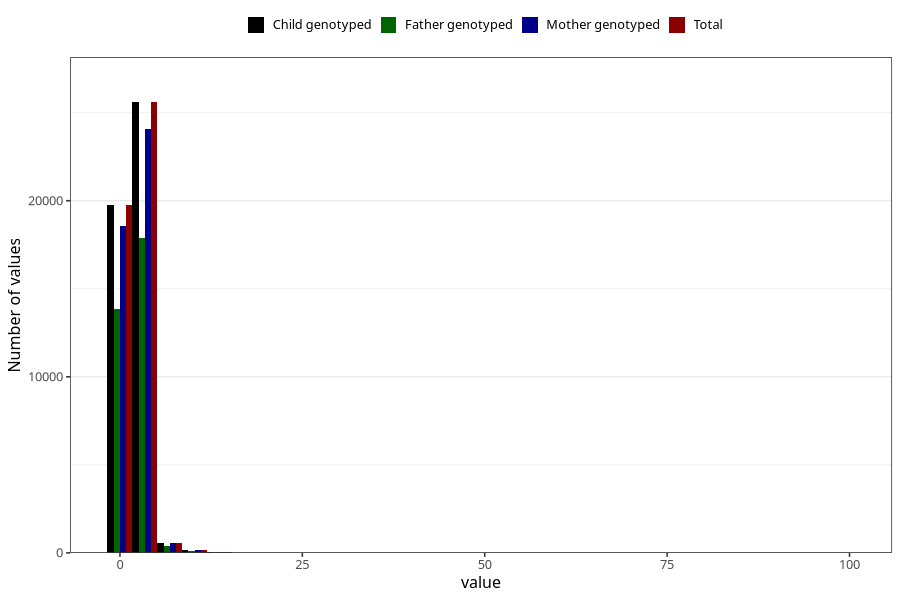

# common_cold_freq_6m
Variable mapping to `DD264` in `Skjema4_6mnd_v12`.
- Number of values:

| Value | Total | Child genotyped | Mother genotyped | Father genotyped |
| ----- | ----- | --------------- | ---------------- | ---------------- |
| Missing | 34868 | 34868 | 32854 | 21016 |
| Non-missing | 46155 | 46155 | 43375 | 32295 |
| 25th percentile | 1 | 1 | 1 | 1 |
| 50th percentile | 2 | 2 | 2 | 2 |
| 75th percentile | 2 | 2 | 2 | 2 |
| Mean | 1.97605893186004 | 1.97605893186004 | 1.97399423631124 | 1.97268927078495 |
| Standard deviation | 1.76421694699249 | 1.76421694699249 | 1.78074126674533 | 1.74221064975725 |
| N | 46155 | 46155 | 43375 | 32295 |

