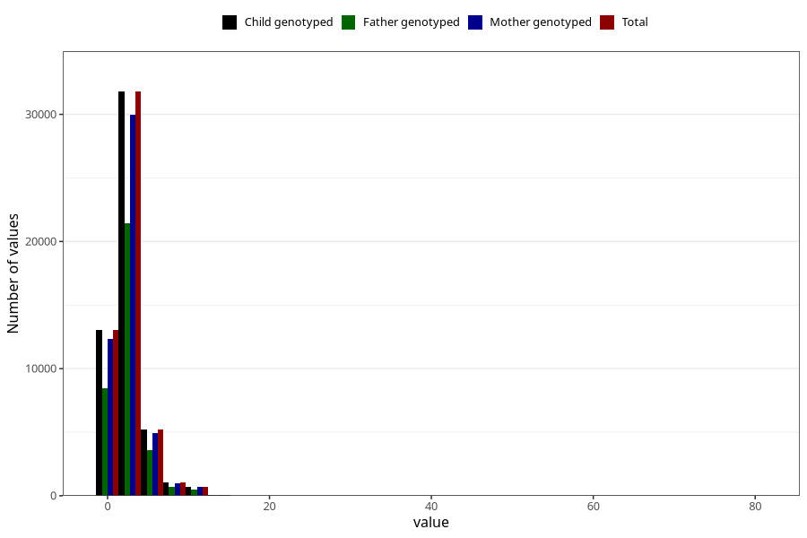

# common_cold_number_12_18m
Variable mapping to `EE218` in `Skjema5_18mnd_v12`.
- Number of values:

| Value | Total | Child genotyped | Mother genotyped | Father genotyped |
| ----- | ----- | --------------- | ---------------- | ---------------- |
| Missing | 29139 | 29139 | 27306 | 18536 |
| Non-missing | 51884 | 51884 | 48923 | 34775 |
| Filled in text or mark instead of number | 6 | 6 | 5 |5 |
| 25th percentile | 1 | 1 | 1 | 2 |
| 50th percentile | 2 | 2 | 2 | 2 |
| 75th percentile | 3 | 3 | 3 | 4 |
| Mean | 2.74819769459116 | 2.74819769459116 | 2.74620793981765 | 2.77952257693414 |
| Standard deviation | 1.91787206386605 | 1.91787206386605 | 1.90966851906459 | 1.93107840943105 |
| N | 51878 | 51878 | 48918 | 34770 |

