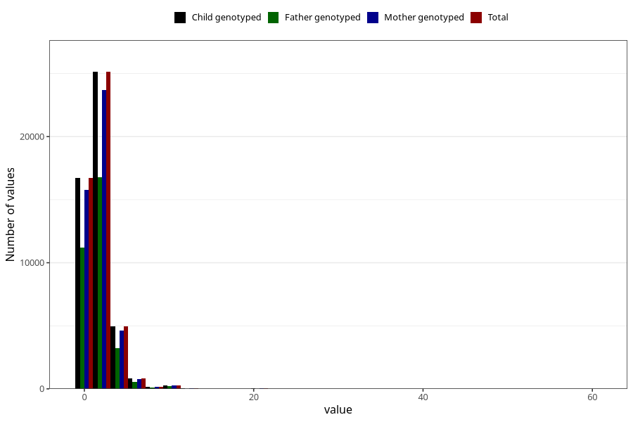

# common_cold_number_6_11m
Variable mapping to `EE216` in `Skjema5_18mnd_v12`.
- Number of values:

| Value | Total | Child genotyped | Mother genotyped | Father genotyped |
| ----- | ----- | --------------- | ---------------- | ---------------- |
| Missing | 32834 | 32834 | 30807 | 21095 |
| Non-missing | 48189 | 48189 | 45422 | 32216 |
| Filled in text or mark instead of number | 8 | 8 | 7 |6 |
| 25th percentile | 1 | 1 | 1 | 1 |
| 50th percentile | 2 | 2 | 2 | 2 |
| 75th percentile | 3 | 3 | 3 | 3 |
| Mean | 2.21740935223428 | 2.21740935223428 | 2.21481889243642 | 2.21421918658802 |
| Standard deviation | 1.52444885572674 | 1.52444885572674 | 1.52533417920341 | 1.54640803206175 |
| N | 48181 | 48181 | 45415 | 32210 |

