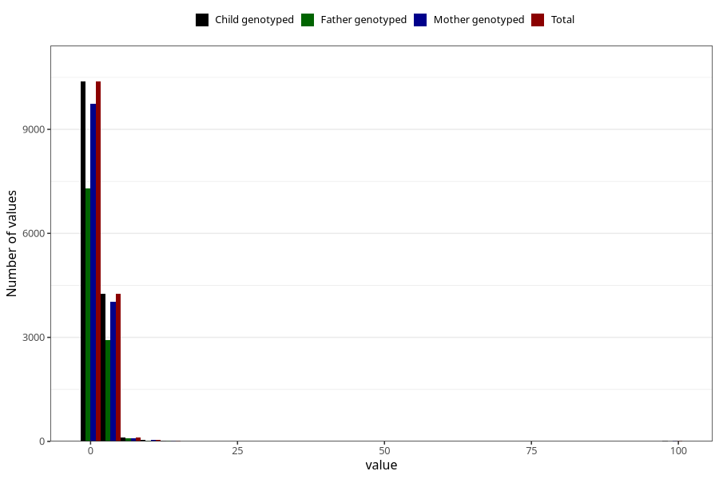

# conjunctivities_freq_6m
Variable mapping to `DD292` in `Skjema4_6mnd_v12`.
- Number of values:

| Value | Total | Child genotyped | Mother genotyped | Father genotyped |
| ----- | ----- | --------------- | ---------------- | ---------------- |
| Missing | 66173 | 66173 | 62284 | 42942 |
| Non-missing | 14850 | 14850 | 13945 | 10369 |
| 25th percentile | 1 | 1 | 1 | 1 |
| 50th percentile | 1 | 1 | 1 | 1 |
| 75th percentile | 2 | 2 | 2 | 2 |
| Mean | 1.61111111111111 | 1.61111111111111 | 1.6150591609896 | 1.58838846561867 |
| Standard deviation | 3.00098942835616 | 3.00098942835616 | 3.06425776859873 | 2.909568776968 |
| N | 14850 | 14850 | 13945 | 10369 |

