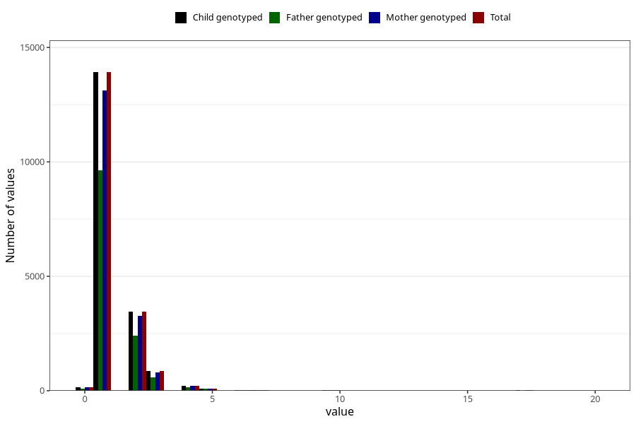

# conjunctivitis_number_12_18m
Variable mapping to `EE253` in `Skjema5_18mnd_v12`.
- Number of values:

| Value | Total | Child genotyped | Mother genotyped | Father genotyped |
| ----- | ----- | --------------- | ---------------- | ---------------- |
| Missing | 62218 | 62218 | 58489 | 40308 |
| Non-missing | 18805 | 18805 | 17740 | 13003 |
| Filled in text or mark instead of number | 1 | 1 | 1 |0 |
| 25th percentile | 1 | 1 | 1 | 1 |
| 50th percentile | 1 | 1 | 1 | 1 |
| 75th percentile | 2 | 2 | 2 | 2 |
| Mean | 1.38747075090406 | 1.38747075090406 | 1.38919894018829 | 1.39252480196878 |
| Standard deviation | 1.07454651885504 | 1.07454651885504 | 1.0800878836172 | 1.10579271446383 |
| N | 18804 | 18804 | 17739 | 13003 |

