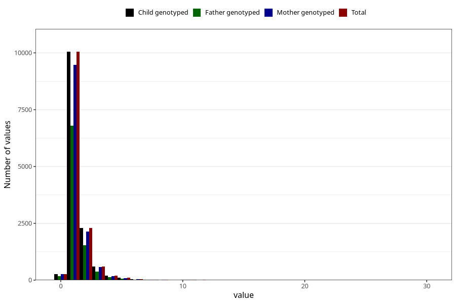

# conjunctivitis_number_6_11m
Variable mapping to `EE251` in `Skjema5_18mnd_v12`.
- Number of values:

| Value | Total | Child genotyped | Mother genotyped | Father genotyped |
| ----- | ----- | --------------- | ---------------- | ---------------- |
| Missing | 67412 | 67412 | 63394 | 44146 |
| Non-missing | 13611 | 13611 | 12835 | 9165 |
| Filled in text or mark instead of number | 2 | 2 | 2 |1 |
| 0 | 269 | 269 | 256 | 184 |
| 1 | 10048 | 10048 | 9475 | 6789 |
| 2 | 2283 | 2283 | 2142 | 1536 |
| 3 | 603 | 603 | 573 | 387 |
| 4 | 190 | 190 | 180 | 129 |
| 5 | 99 | 99 | 95 | 67 |
| 6 | 44 | 44 | 43 | 25 |
| 7 | 16 | 16 | 16 | 12 |
| 8 | 12 | 12 | 11 | 7 |
| 9 | 3 | 3 | 3 | 2 |
| 10 | 24 | 24 | 24 | 15 |
| 11 | 10 | 10 | 8 | 7 |
| 12 | 3 | 3 | 3 | 2 |
| 14 | 1 | 1 | 0 | 1 |
| 15 | 1 | 1 | 1 | 0 |
| 20 | 1 | 1 | 1 | 0 |
| 25 | 1 | 1 | 1 | 0 |
| 30 | 1 | 1 | 1 | 1 |

