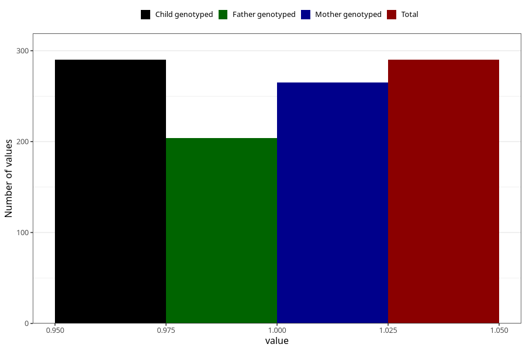

# delayed_motor_development_yes_3y
Variable mapping to `GG38` in `Skjema6_3aar_v12`.
- Number of values:

| Value | Total | Child genotyped | Mother genotyped | Father genotyped |
| ----- | ----- | --------------- | ---------------- | ---------------- |
| Missing | 80733 | 80733 | 75964 | 53107 |
| Non-missing | 290 | 290 | 265 | 204 |
| 1 | 290 | 290 | 265 | 204 |

