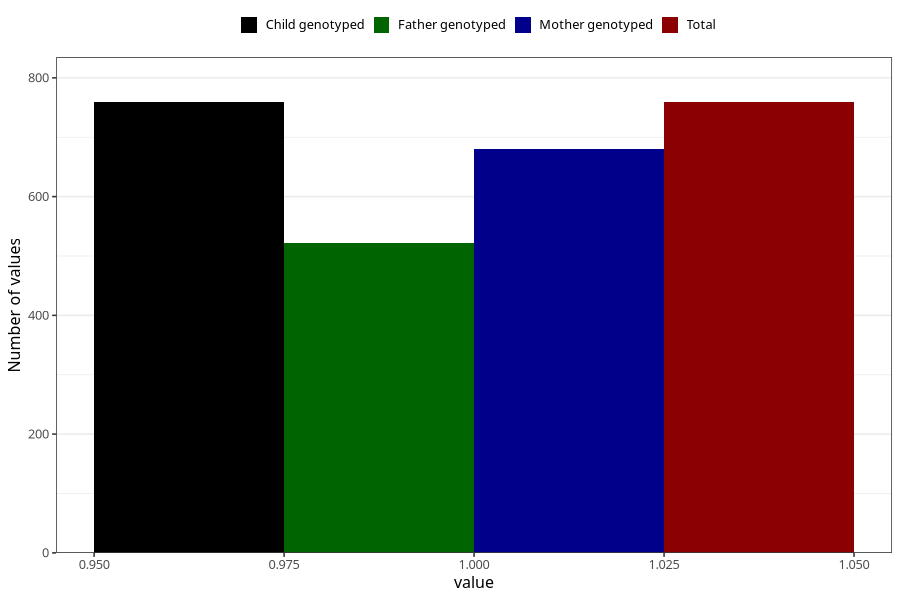

# delayed_or_abnormal_language_development_currently_8y
Variable mapping to `NN41` in `Skjema8aar_v12`.
- Number of values:

| Value | Total | Child genotyped | Mother genotyped | Father genotyped |
| ----- | ----- | --------------- | ---------------- | ---------------- |
| Missing | 80264 | 80264 | 75549 | 52789 |
| Non-missing | 759 | 759 | 680 | 522 |
| 1 | 759 | 759 | 680 | 522 |

