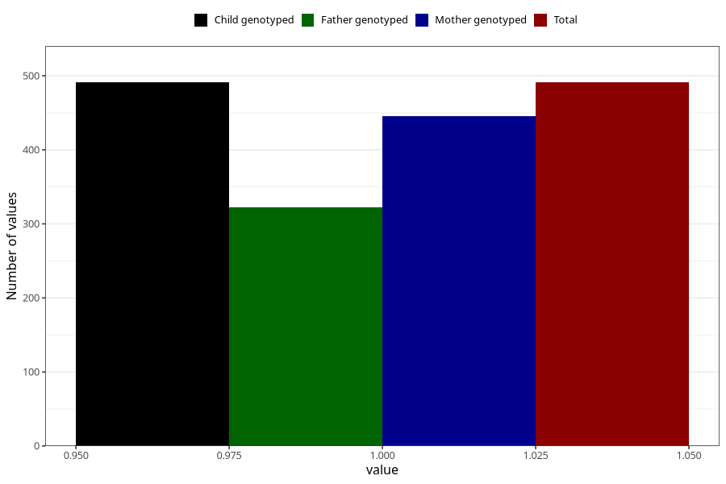

# delayed_speech_development_yes_18m
Variable mapping to `EE840` in `Skjema5_18mnd_v12`.
- Number of values:

| Value | Total | Child genotyped | Mother genotyped | Father genotyped |
| ----- | ----- | --------------- | ---------------- | ---------------- |
| Missing | 80532 | 80532 | 75784 | 52989 |
| Non-missing | 491 | 491 | 445 | 322 |
| 1 | 491 | 491 | 445 | 322 |

