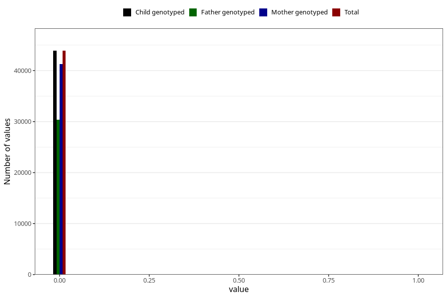

# diabetes_3y
Variable created during phenotype curation.
- Number of values:

| Value | Total | Child genotyped | Mother genotyped | Father genotyped |
| ----- | ----- | --------------- | ---------------- | ---------------- |
| Missing | 37102 | 37102 | 34903 | 22962 |
| Non-missing | 43921 | 43921 | 41326 | 30349 |
| 0 | 43895 | 43895 | 41301 | 30330 |
| 1 | 26 | 26 | 25 | 19 |

