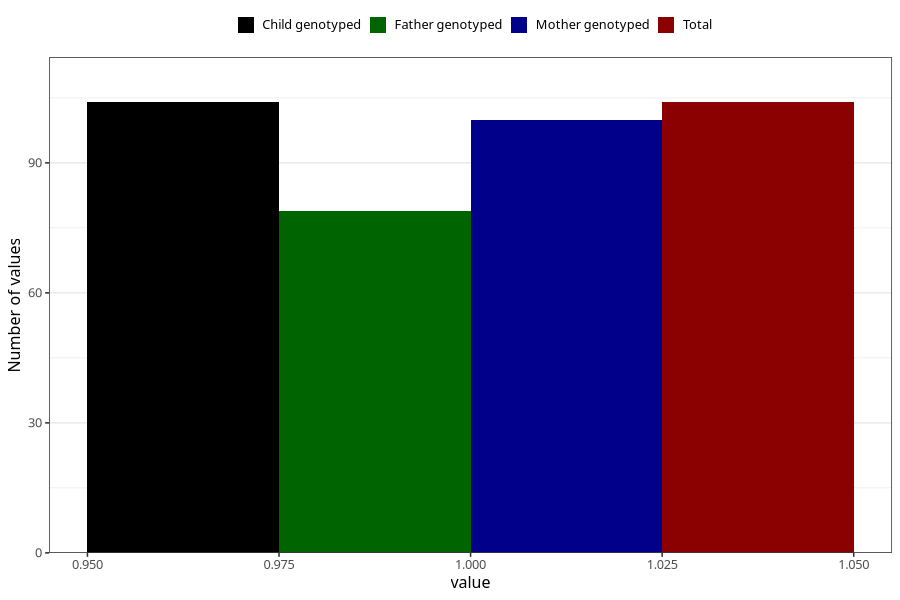

# diabetes_7y
Variable mapping to `JJ429` in `Skjema7aar_v12`.
- Number of values:

| Value | Total | Child genotyped | Mother genotyped | Father genotyped |
| ----- | ----- | --------------- | ---------------- | ---------------- |
| Missing | 80919 | 80919 | 76129 | 53232 |
| Non-missing | 104 | 104 | 100 | 79 |
| 1 | 104 | 104 | 100 | 79 |

