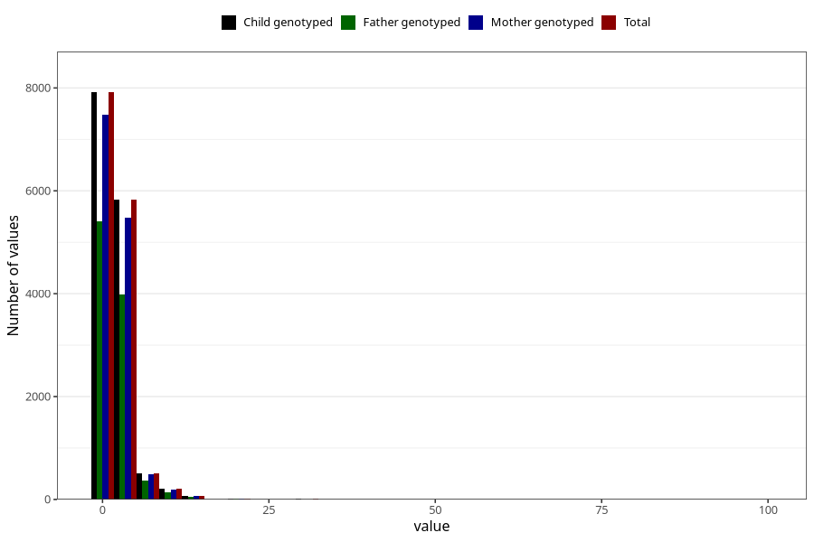

# ear_infection_freq_3y
Variable mapping to `GG138` in `Skjema6_3aar_v12`.
- Number of values:

| Value | Total | Child genotyped | Mother genotyped | Father genotyped |
| ----- | ----- | --------------- | ---------------- | ---------------- |
| Missing | 66463 | 66463 | 62519 | 43336 |
| Non-missing | 14560 | 14560 | 13710 | 9975 |
| 25th percentile | 1 | 1 | 1 | 1 |
| 50th percentile | 1 | 1 | 1 | 1 |
| 75th percentile | 2 | 2 | 2 | 2 |
| Mean | 2.13681318681319 | 2.13681318681319 | 2.13566739606127 | 2.12822055137845 |
| Standard deviation | 2.5718531737436 | 2.5718531737436 | 2.60393629998551 | 2.32356145385403 |
| N | 14560 | 14560 | 13710 | 9975 |

