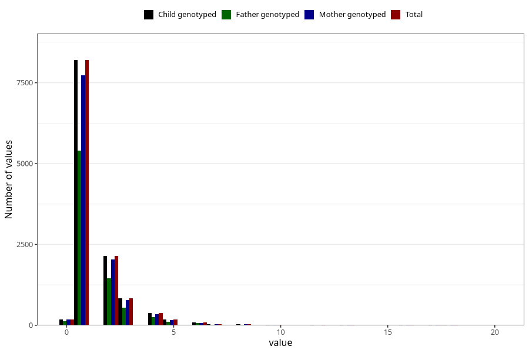

# ear_infection_number_12_18m
Variable mapping to `EE228` in `Skjema5_18mnd_v12`.
- Number of values:

| Value | Total | Child genotyped | Mother genotyped | Father genotyped |
| ----- | ----- | --------------- | ---------------- | ---------------- |
| Missing | 68918 | 68918 | 64797 | 45284 |
| Non-missing | 12105 | 12105 | 11432 | 8027 |
| 25th percentile | 1 | 1 | 1 | 1 |
| 50th percentile | 1 | 1 | 1 | 1 |
| 75th percentile | 2 | 2 | 2 | 2 |
| Mean | 1.58281701776126 | 1.58281701776126 | 1.58554933519944 | 1.57879656160458 |
| Standard deviation | 1.38640201131826 | 1.38640201131826 | 1.39497870878044 | 1.36922273259354 |
| N | 12105 | 12105 | 11432 | 8027 |

