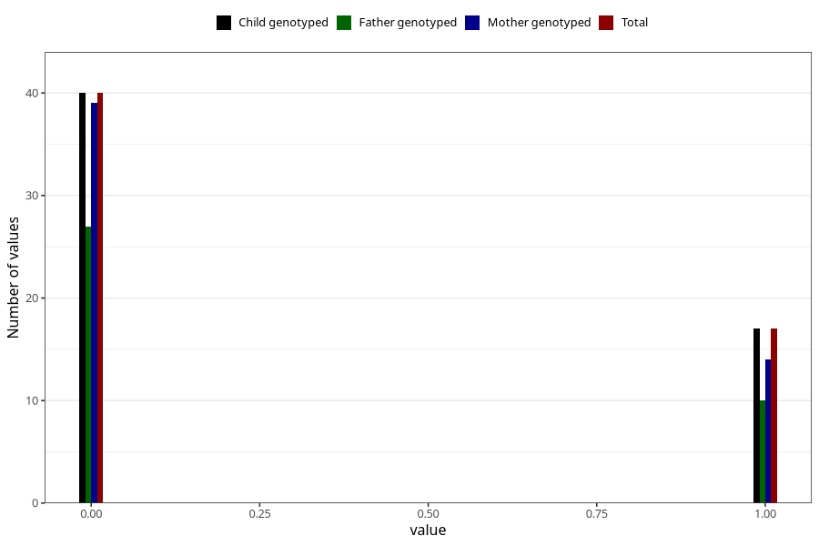

# encephalitis_meningitis_freq_3y
Variable mapping to `GG156` in `Skjema6_3aar_v12`.
- Number of values:

| Value | Total | Child genotyped | Mother genotyped | Father genotyped |
| ----- | ----- | --------------- | ---------------- | ---------------- |
| Missing | 80966 | 80966 | 76176 | 53274 |
| Non-missing | 57 | 57 | 53 | 37 |
| 0 | 40 | 40 | 39 | 27 |
| 1 | 17 | 17 | 14 | 10 |

