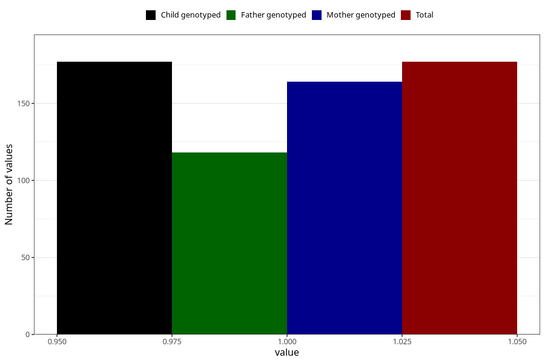

# epilepsy_7y
Variable mapping to `JJ434` in `Skjema7aar_v12`.
- Number of values:

| Value | Total | Child genotyped | Mother genotyped | Father genotyped |
| ----- | ----- | --------------- | ---------------- | ---------------- |
| Missing | 80846 | 80846 | 76065 | 53193 |
| Non-missing | 177 | 177 | 164 | 118 |
| 1 | 177 | 177 | 164 | 118 |

