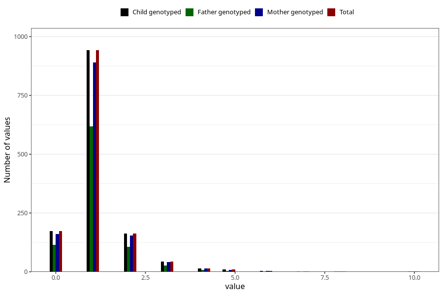

# febrile_convulsions_number_12_18m
Variable mapping to `EE258` in `Skjema5_18mnd_v12`.
- Number of values:

| Value | Total | Child genotyped | Mother genotyped | Father genotyped |
| ----- | ----- | --------------- | ---------------- | ---------------- |
| Missing | 79667 | 79667 | 74948 | 52428 |
| Non-missing | 1356 | 1356 | 1281 | 883 |
| 0 | 174 | 174 | 161 | 114 |
| 1 | 942 | 942 | 891 | 619 |
| 2 | 162 | 162 | 154 | 106 |
| 3 | 43 | 43 | 42 | 27 |
| 4 | 14 | 14 | 14 | 9 |
| 5 | 11 | 11 | 9 | 4 |
| 6 | 4 | 4 | 4 | 1 |
| 7 | 2 | 2 | 2 | 0 |
| 8 | 2 | 2 | 2 | 2 |
| 10 | 2 | 2 | 2 | 1 |

