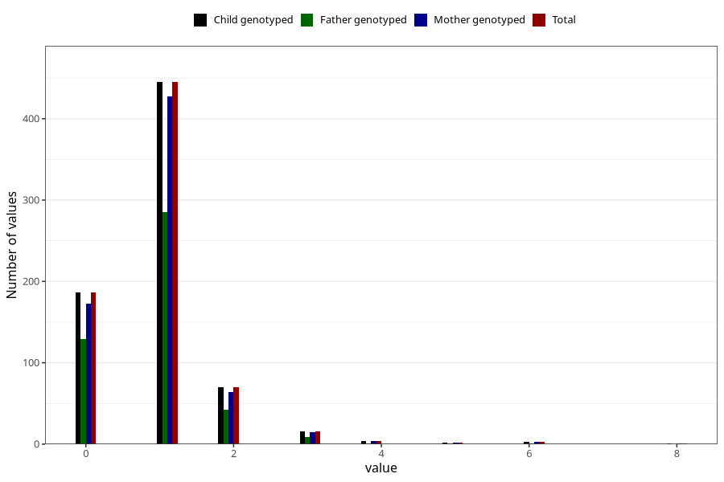

# febrile_convulsions_number_6_11m
Variable mapping to `EE256` in `Skjema5_18mnd_v12`.
- Number of values:

| Value | Total | Child genotyped | Mother genotyped | Father genotyped |
| ----- | ----- | --------------- | ---------------- | ---------------- |
| Missing | 80296 | 80296 | 75540 | 52843 |
| Non-missing | 727 | 727 | 689 | 468 |
| 0 | 186 | 186 | 173 | 129 |
| 1 | 445 | 445 | 427 | 285 |
| 2 | 70 | 70 | 64 | 42 |
| 3 | 16 | 16 | 15 | 9 |
| 4 | 4 | 4 | 4 | 1 |
| 5 | 2 | 2 | 2 | 1 |
| 6 | 3 | 3 | 3 | 1 |
| 8 | 1 | 1 | 1 | 0 |

