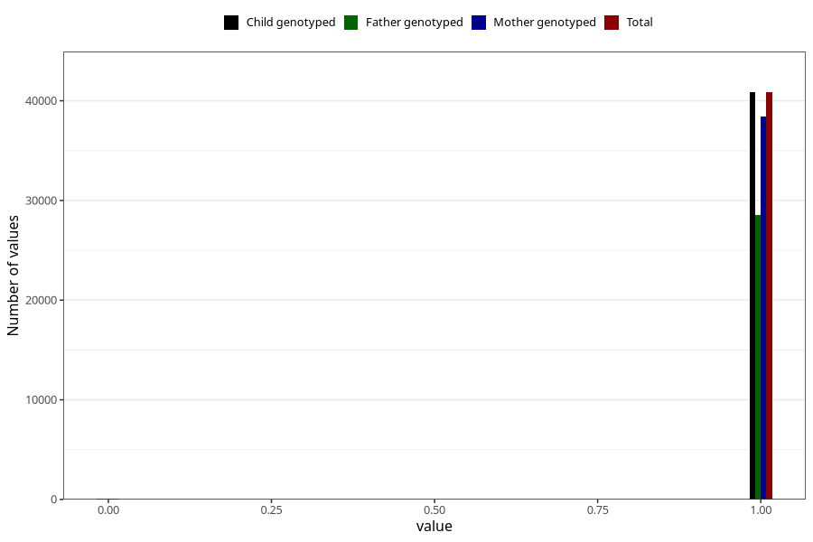

# frequent_stomach_pain_no_3y
Variable mapping to `GG570` in `Skjema6_3aar_v12`.
- Number of values:

| Value | Total | Child genotyped | Mother genotyped | Father genotyped |
| ----- | ----- | --------------- | ---------------- | ---------------- |
| Missing | 40063 | 40063 | 37704 | 24714 |
| Non-missing | 40960 | 40960 | 38525 | 28597 |
| 0 | 109 | 109 | 102 | 73 |
| 1 | 40851 | 40851 | 38423 | 28524 |

