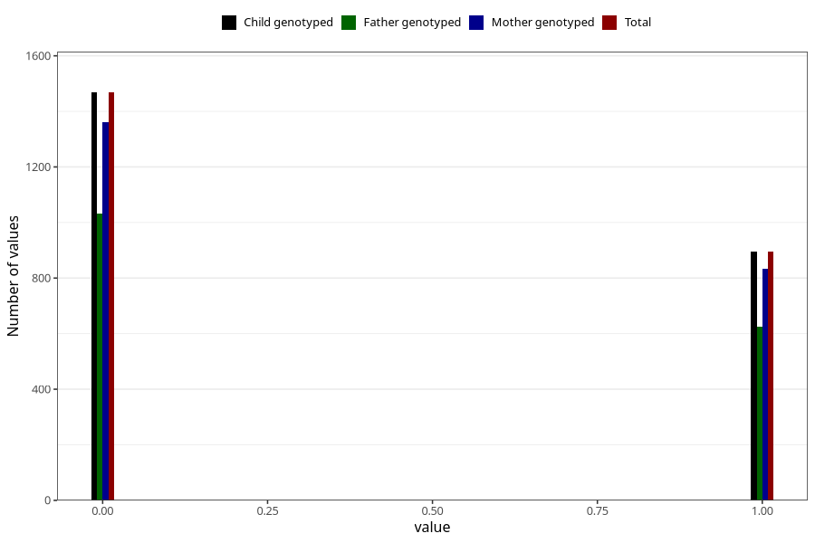

# frequent_stomach_pain_previous_3y
Variable mapping to `GG572` in `Skjema6_3aar_v12`.
- Number of values:

| Value | Total | Child genotyped | Mother genotyped | Father genotyped |
| ----- | ----- | --------------- | ---------------- | ---------------- |
| Missing | 78659 | 78659 | 74037 | 51654 |
| Non-missing | 2364 | 2364 | 2192 | 1657 |
| 0 | 1468 | 1468 | 1360 | 1031 |
| 1 | 896 | 896 | 832 | 626 |

